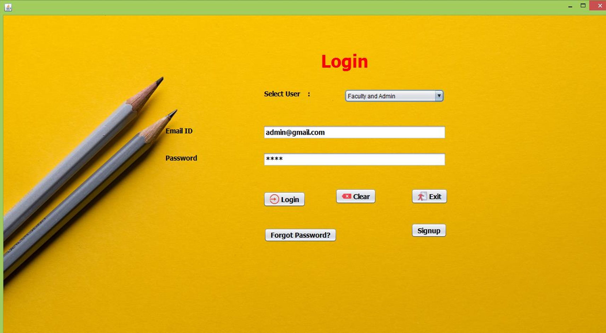
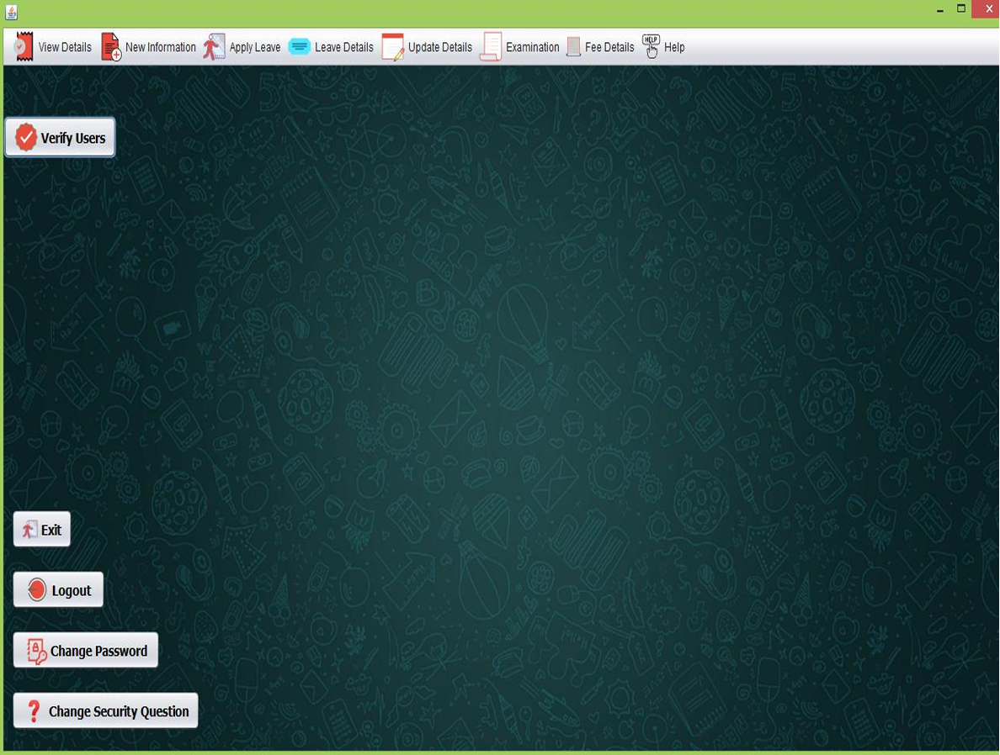
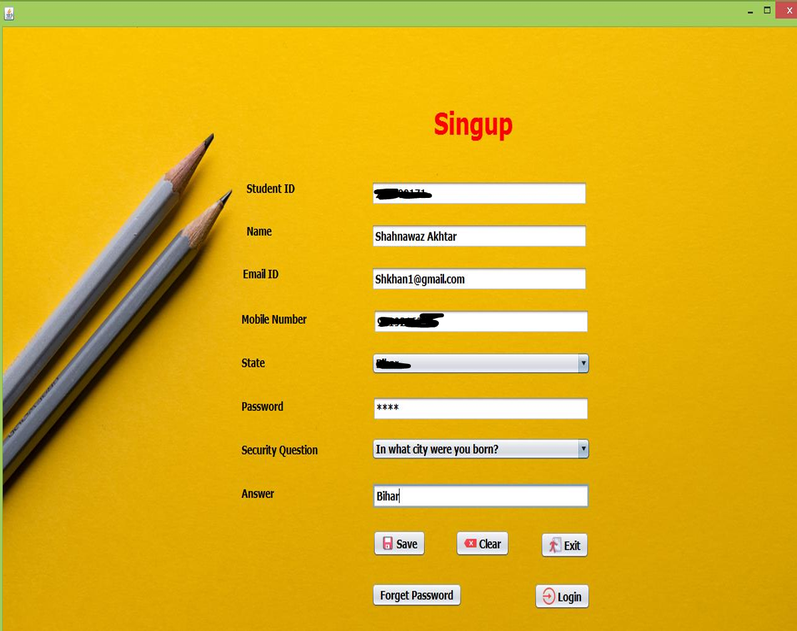
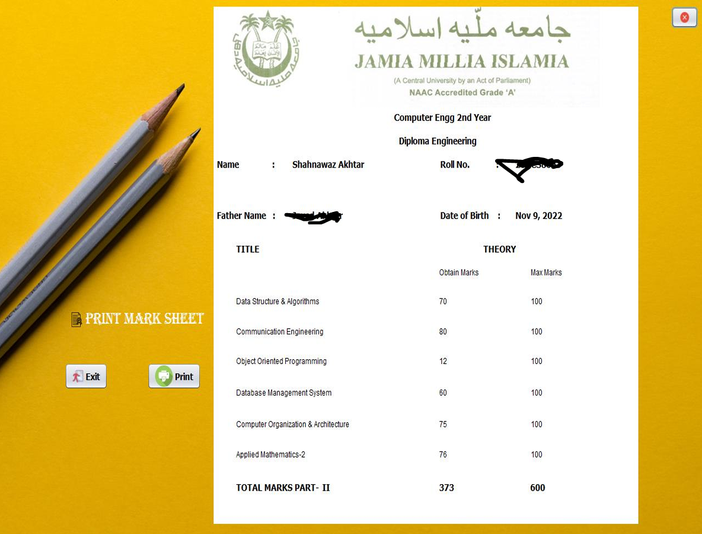
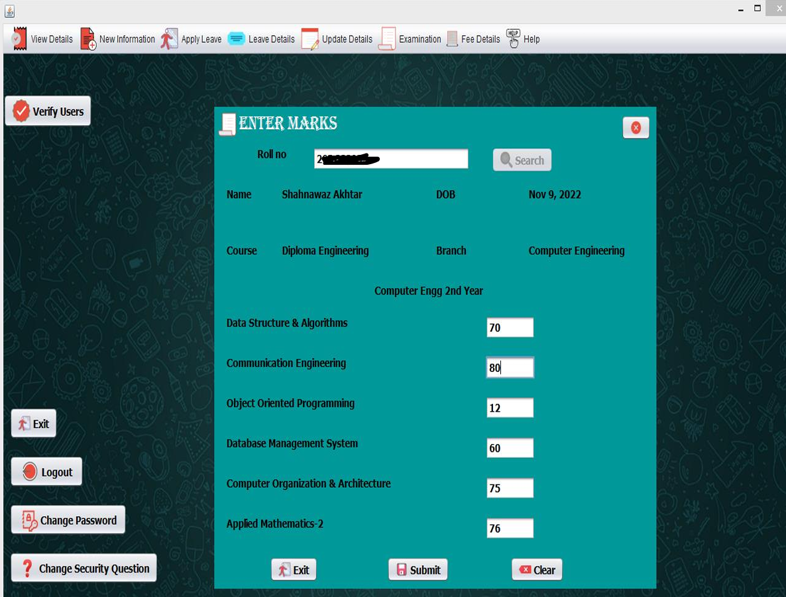

# 🎓 University Management System (Java Swing + MySQL)

A **desktop-based University Management System** developed using **Java Swing** and **MySQL**.
This application helps manage **students, faculty, examinations, fees, attendance, and leave records** through a clean and user-friendly graphical interface.

The project is designed for **academic submission, viva examinations, and interview demonstrations**.

---
## 📸 Screenshots

### 🔐 Login Screen


### 🏠 Dashboard


### 👨‍🎓 SingUP


### 💰 MarkSheet


### 📝 Marks Module


## 🚀 Features

- 🔐 **Secure Login System**
- 👨‍🎓 **Student Management** (Add, Update, View)
- 👩‍🏫 **Teacher / Faculty Management**
- 📝 **Examination & Marks Management**
- 💰 **Fee Structure & Payment Module**
- 🏖 **Student & Teacher Leave Management**
- 📊 **Database-driven records** using MySQL
- 🖥 **Desktop GUI** using Java Swing
- 🪟 **Windows Executable (.exe)** support

---

## 🛠 Tech Stack

| Technology | Description |
|:---|:---|
| **Language** | Java (JDK 8+) |
| **GUI** | Java Swing |
| **Database** | MySQL |
| **Connectivity** | JDBC |
| **IDE** | NetBeans |
| **Build Tool** | Apache Ant |
| **EXE Wrapper** | Launch4j |
| **Platform** | Windows |

---

## 📂 Project Structure

```text
University-Management-System/
│
├── src/
│   └── institution/management/system/
│       ├── Login.java
│       ├── Conn.java
│       ├── Project.java
│       ├── AddStudent.java
│       ├── AddTeacher.java
│       ├── StudentDetails.java
│       ├── TeacherDetails.java
│       ├── Marks.java
│       ├── FeeStructure.java
│       ├── StudentLeave.java
│       ├── TeacherLeave.java
│       ├── UpdateStudent.java
│       └── UpdateTeacher.java
│
├── lib/
│   ├── mysql-connector-java-8.0.28.jar
│   ├── rs2xml.jar
│   └── jcalendar-tz-1.3.3-4.jar
│
├── database/
│   └── universitymanagementsystem.sql
│
├── assets/
│   ├── icons/
│   └── screenshots/
│
├── dist/
│   └── UniversityManagementSystem.jar
│
├── UniversityManagementSystem.exe
└── README.md
```

## 🗄 Database Setup

1. Start **MySQL Server**
2. Create database:
   ```sql
   CREATE DATABASE universitymanagementsystem;

